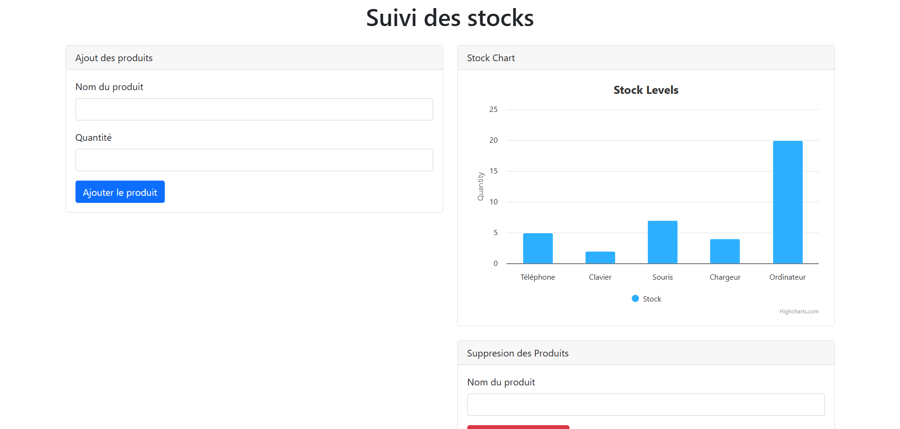
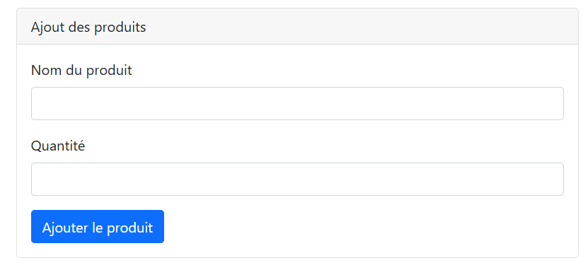
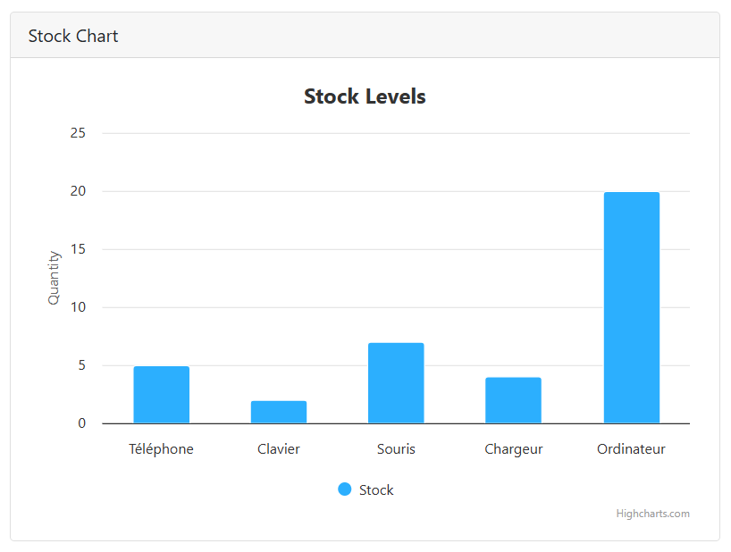
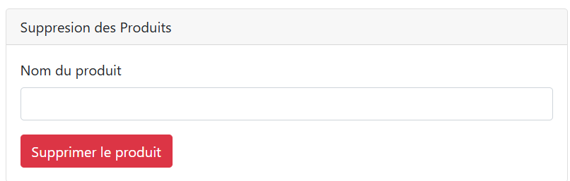
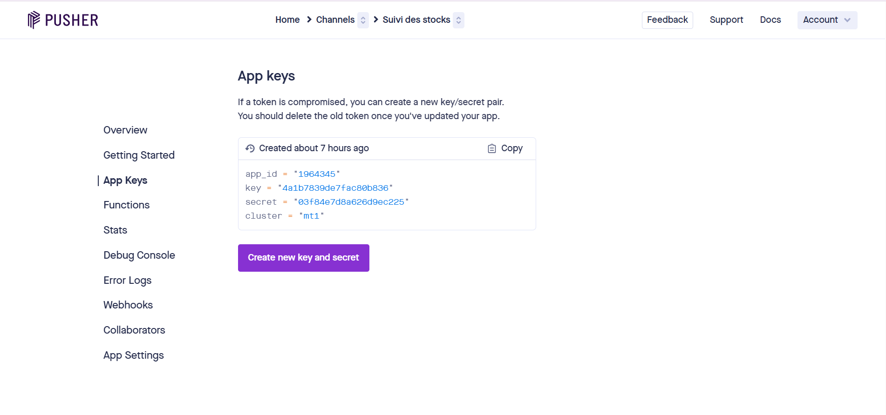

# Suivi des Stocks en Temps Réel

## Description
Cette application permet le suivi des stocks en temps réel où plusieurs utilisateurs peuvent voir les mises à jour instantanément via WebSockets. Les données sont affichées sous forme de graphique grâce à Highcharts.

## Technologies Utilisées
- Laravel
- Laravel WebSockets
- Pusher
- Highcharts
- Bootstrap
- JavaScript

## Installation

### Prérequis
- PHP 8+
- Composer
- Node.js
- Laravel installé

### Étapes d'installation
1. Cloner le dépôt :
   ```sh
   git clone https://github.com/Lorraine301/Atelier5_Exercice4_Suivi_des_stocks.git
   cd Atelier5_Exercice4_Suivi_des_stocks
   ```
2. Installer les dépendances :
   ```sh
   composer install
   npm install
   ```
3. Configurer l'environnement :
   - Voir le fichier  `.env`
   - Modifier les informations de connexion à la base de données
   - Ajouter les clés Pusher :
     ```env
     PUSHER_APP_ID=1964345
     PUSHER_APP_KEY=4a1b7839de7fac80b836
     PUSHER_APP_SECRET=03f84e7d8a626d9ec225
     PUSHER_APP_CLUSTER=mt1
     ```

4. Exécuter les migrations :
   ```sh
   php artisan migrate
   ```
5. Démarrer Laravel WebSockets :
   ```sh
   php artisan websockets:serve
   ```
7. Lancer le serveur Laravel :
   ```sh
   php artisan serve
   ```

## Explication du Code

### Modèle Stock
```php
namespace App\Models;

use Illuminate\Database\Eloquent\Model;

class Stock extends Model
{
    protected $fillable = ['product_name', 'quantity'];
    protected $casts = [
        'quantity' => 'integer'
    ];
}
```
- Définit la structure des stocks et les champs modifiables.

### Événement StockUpdated
```php
namespace App\Events;

use App\Models\Stock;
use Illuminate\Broadcasting\Channel;
use Illuminate\Contracts\Broadcasting\ShouldBroadcast;

class StockUpdated implements ShouldBroadcast
{
    public $stock;

    public function __construct(Stock $stock)
    {
        $this->stock = $stock;
    }

    public function broadcastOn()
    {
        return new Channel('stocks');
    }
}
```
- Diffuse les mises à jour des stocks aux autres utilisateurs.

### Contrôleur StockController
```php
namespace App\Http\Controllers;

use App\Events\StockUpdated;
use App\Models\Stock;
use Illuminate\Http\Request;

class StockController extends Controller
{
    public function index()
    {
        return response()->json(Stock::all());
    }

    public function store(Request $request)
    {
        $stock = Stock::create($request->validate([
            'product_name' => 'required|string|max:255',
            'quantity' => 'required|integer|min:0'
        ]));
        broadcast(new StockUpdated($stock))->toOthers();
        return response()->json($stock, 201);
    }

    public function update(Request $request, $id)
    {
        $stock = Stock::findOrFail($id);
        $stock->update($request->validate(['quantity' => 'required|integer|min:0']));
        broadcast(new StockUpdated($stock))->toOthers();
        return response()->json($stock);
    }

    public function destroy($id)
    {
        $stock = Stock::findOrFail($id);
        $stock->delete();
        broadcast(new StockUpdated($stock))->toOthers();
        return response()->json(null, 204);
    }
}
```
- Implémente les actions CRUD et diffuse les mises à jour.

### Routes API
```php
use App\Http\Controllers\StockController;

Route::apiResource('stocks', StockController::class);
```
- Définit les routes pour gérer les stocks.

## Interface Graphique
L'application affiche un graphique des stocks avec Highcharts et propose des formulaires pour ajouter et supprimer des produits.

Interface Principale


Ajout des produits



Graphe pour les stocks



Suppression des produits



Compte Pusher pour la configuration




## Lancement de l'Application
1. Démarrer Laravel WebSockets :
   ```sh
   php artisan websockets:serve
   ```
2. Lancer le serveur Laravel :
   ```sh
   php artisan serve
   ```
3. Ouvrir `http://127.0.0.1:8000` dans le navigateur.
4.Ouvrir `index.html` dans le navigateur pour manipuler le suivi des stocks

## Conclusion
Cette application fournit une solution efficace pour le suivi des stocks en temps réel en utilisant Laravel, Pusher et Highcharts. Grâce à WebSockets, les utilisateurs peuvent visualiser instantanément les changements de stock sans avoir besoin de recharger la page. Cette approche moderne garantit une gestion fluide et interactive des produits, rendant l'expérience utilisateur plus dynamique et intuitive.

🔹 **Points forts de l'application** :
- **Mises à jour en temps réel** avec Laravel WebSockets.
- **Interface dynamique** et conviviale grâce à Highcharts et Bootstrap.
- **Gestion complète des stocks** (ajout, modification, suppression).
- **API RESTful** permettant une intégration facile avec d'autres services.


## Auteur
Lorraine301

## Licence
Cet exercice utilise la licence MIT
